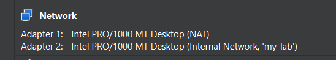
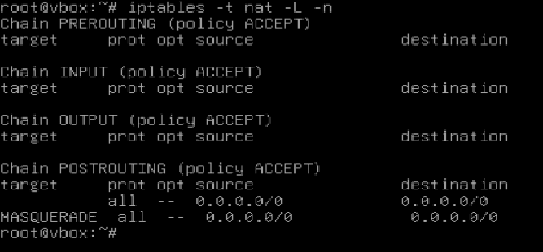
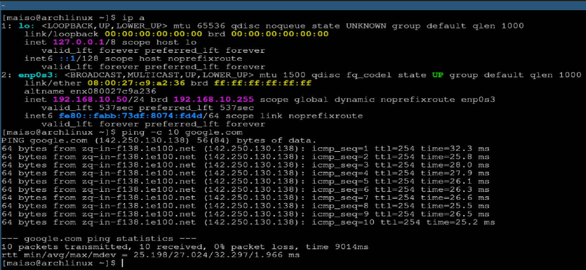

# home-lab-router
Debian-based router with NAT, DHCP, and IP forwarding for a virtual lab environment

# Linux Network Infrastructure Lab

This project demonstrates a fully functional virtual network infrastructure built on Linux. It features a Debian-based router providing internet access and automated network configuration to client machines.

## Topology
* **Router (ISP Gateway):** Debian 13
* **Client:** Arch Linux 
* **Network Type:** VirtualBox Internal Network

## Features & Implementation
1. **Network Routing:** Configured dual-stack interfaces for WAN (NAT) and LAN (Internal).
2. **NAT & Masquerading:** Implemented `iptables` rules to allow internal clients to access the internet via the router's IP.
3. **IP Forwarding:** Enabled kernel-level packet forwarding between interfaces.
4. **DHCP Server:** Deployed `isc-dhcp-server` to automatically assign IP addresses in the `192.168.10.0/24` range.

## Key Config Files
* `/etc/network/interfaces` - Static IP and interface configuration.
* `/etc/dhcp/dhcpd.conf` - DHCP scopes and gateway options.
* `ip_forward` - Enabled via `/etc/sysctl.conf`.

## Verification
The setup was verified by successfully leasing an IP address to an Arch Linux client and confirming external connectivity via ICMP pings to `8.8.8.8`.

### Screenshots
## Implementation Details

### 1. Virtual Machine Network Configuration
To establish the connection, I configured two network adapters on the Debian Router:
* **Adapter 1:** NAT (for Internet access)
* **Adapter 2:** Internal Network (for the local segment)

### 2. Network Verification

**1. Network Routing & NAT Table on Debian:**

**2. Client Connectivity (Arch Linux) & DHCP Lease:**

